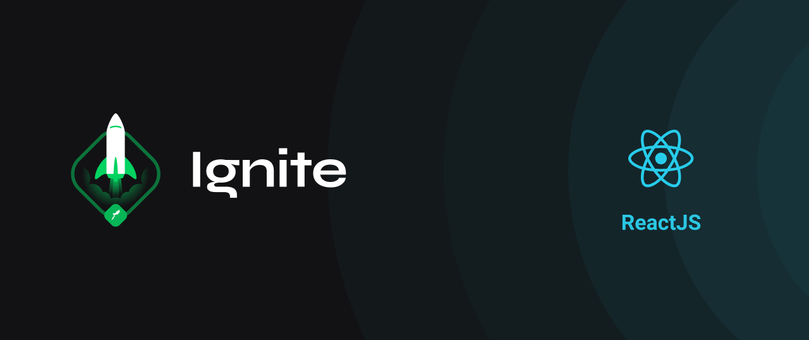

# Ignite - ReactJS
During my studies in the Rocketseat Ignite program, I focused mainly on ReactJS, using TypeScript and libraries such as styled-components, stitches, json-server, axios and many others. These projects gave me an in-depth understanding of front-end web development and helped me develop robust and scalable applications. I am excited to continue honing my skills and exploring new technologies in the field of web development.

## Classes
- [Ignite Feed](https://github.com/bw3sley/ignite-feed)
- [Ignite Pomodoro](https://github.com/bw3sley/ignite-pomodoro)
- [Ignite Dt Money](https://github.com/bw3sley/ignite-dt-money)
- [Ignite Shop](https://github.com/bw3sley/ignite-shop)

## Challenges
- [Ignite to do](https://github.com/bw3sley/ignite-shop)

## Masterclass
- [Ignite Twitter UI](https://github.com/bw3sley/ignite-twitter-ui)
